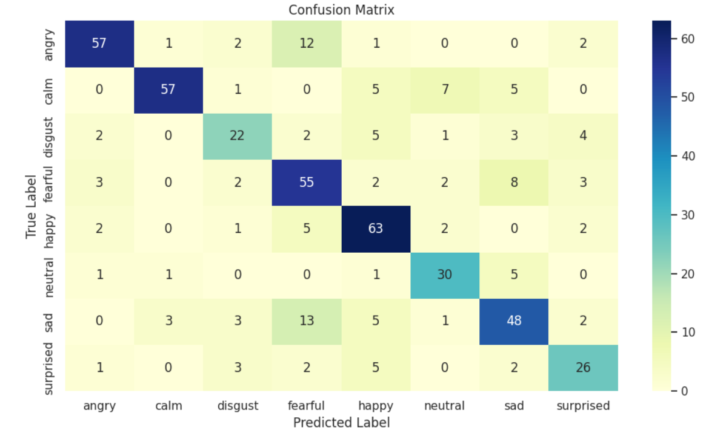
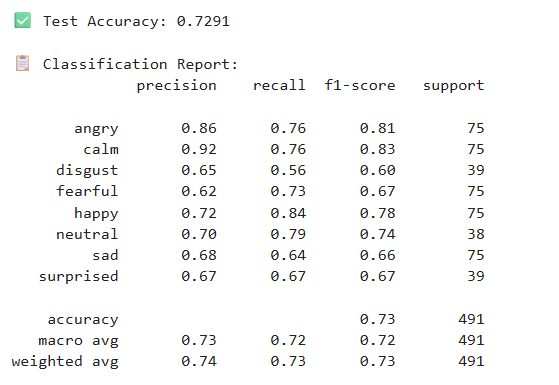

# 🎧 Audio Emotion Recognition with Attention BiLSTM

This project focuses on classifying human emotions from raw `.wav` audio files using a deep learning model based on **Bidirectional LSTMs with Attention**. It includes tools for training, testing, and visualizing results through a Streamlit web interface.

---

## 🚀 Project Highlights

- **Dataset**: RAVDESS (Audio_Speech_Actors_01-24 and Audio_Song_Actors_01-24)
- **Features Used**: MFCC (Mel-Frequency Cepstral Coefficients)
- **Model Architecture**:
  - Bidirectional LSTM × 2
  - Custom Attention Layer
  - Dense Layers
- **Performance Metrics**: Accuracy, Classification Report, Confusion Matrix
- **Interface**: Streamlit-based app for uploading and testing audio files
- **Tools**: TensorFlow, Keras, librosa, scikit-learn

---

## 📁 Folder Structure

```
audio_emotion_recognition/
│
├── app.py                   # Streamlit Web UI
├── test_model.py           # Script to evaluate model on test dataset
├── models/
│   ├── trained_model.h5    # Trained Keras model
│   ├── scaler.pkl          # Fitted StandardScaler for MFCC
│   └── label_encoder.pkl   # LabelEncoder for emotion labels
├── dataset/
│   ├── Audio_Speech_Actors_01-24/
│   └── Audio_Song_Actors_01-24/
├── requirements.txt
└── Attention-BiLSTM_notebook.ipynb  # Full training workflow
```

---

## 🧪 Testing the Model

Use the script below to run model evaluation on your `.wav` dataset:

```bash
python test_model.py
```

📊 Example Outputs:

## Confusion Matrix



## Classification Report



---

## 🌐 Streamlit App

Launch the app to test your model live:

```bash
streamlit run app.py
```

Upload a `.wav` file and view real-time emotion classification!

---

## ⚙️ Setup Instructions

### 1. Clone and Install Dependencies

```bash
git clone https://github.com/yourusername/audio_emotion_recognition.git
cd audio_emotion_recognition
pip install -r requirements.txt
```

> Use Python 3.8+ for compatibility

### 2. Required Files

Make sure the following files are present:

- `models/trained_model.h5`
- `models/scaler.pkl`
- `models/label_encoder.pkl`

---

## 🧠 Model Summary

A custom `AttentionLayer` is used to emphasize relevant time steps in the audio sequence before final classification. The model was trained on MFCC features extracted from RAVDESS and uses a balanced dataset (via oversampling).

---

## 🔍 Sample Classification Classes

- Neutral
- Calm
- Happy
- Sad
- Angry
- Fearful
- Disgust
- Surprised

---

## 📦 Requirements

All dependencies are listed in `requirements.txt`:

```text
numpy
pandas
librosa
scikit-learn
matplotlib
seaborn
tensorflow
keras
joblib
imblearn
soundfile
packaging
streamlit
```

---

## ✍️ Credits

Developed by Hemant Bhakar  
